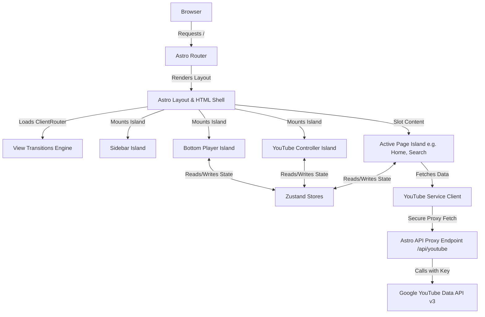

# SONIVIO v2 - System Architecture & Technical Specifications

This document outlines the software engineering decisions, directory organization, state management design, and performance optimizations implemented in **SONIVIO v2**.

---

## 1. Architectural Design Overview

SONIVIO v2 is structured as a **hybrid multi-page application (MPA)** built on the **Astro** web framework. The system is designed around the **Islands Architecture**, where static content is pre-rendered to pure HTML on the server (or at the edge), while complex dynamic interactions are delegated to interactive **React Islands**.



### Core Architectural Decisions:

1. **Continuous Audio Stream (Astro View Transitions)**:
   In a typical multi-page application, transitioning between routes (e.g. `/` to `/search`) destroys the DOM and the running JavaScript thread, which would immediately terminate music playback. We utilize Astro's `<ClientRouter />` alongside the `transition:persist` directive to preserve the `BottomPlayer`, `Sidebar`, and `HiddenYouTube` React islands across page swaps. This maintains a running JS heap and keeps the audio playing continuously.
   
2. **Secure Server-Side API Proxy**:
   To prevent quota abuse and shield the YouTube Data API key from exposure in the client browser's Network tab, we route all data requests through an Astro SSR API route: `/api/youtube.ts`. The API key is stored strictly as a server-side environment variable on Cloudflare Pages and is never sent to the client.

3. **Decoupled Client-State Store**:
   Instead of a monolithic Zustand store, the system splits client state into four separate stores to isolate responsibilities, limit rendering scopes, and manage persistence granularly.

---

## 2. Zustand State Management Architecture

State is divided across four stores, which can query or trigger actions in one another using getter calls (`getState()`) without introducing circular hook dependencies.

* **Player Store (`playerStore.ts`)**:
  * *State*: `currentTrack`, `isPlaying`, `isMuted`, `volume`, `progress`, `duration`, `shuffle`, `repeatMode`, `lastPlayedPosition`.
  * *Persistence*: Volume, muted status, repeat mode, and shuffle parameters are persisted in `localStorage`.
  
* **Queue Store (`queueStore.ts`)**:
  * *State*: Playback queue list `queue` (wrapped in unique `QueueItem` instances to support duplicate tracks), `queueIndex`, `currentQueueItem`.
  * *Persistence*: The active queue is persisted so that user playlists survive page refreshes.
  
* **Library Store (`libraryStore.ts`)**:
  * *State*: `likedSongs` (favorites), `recentlyPlayed`, `listeningHistory`, custom user `playlists`, and `apiCache` (cache storage for endpoint queries).
  * *Persistence*: The entire user library (favorites and custom local playlists) is persisted to `localStorage`.
  
* **UI Store (`uiStore.ts`)**:
  * *State*: Global notifications/toasts list `toasts`, `isQueueOpen`, `isKeyboardHelpOpen`, and `isExpanded` (fullscreen player visibility).
  * *Persistence*: None (ephemeral session state).

---

## 3. Directory Structure Explanation

```
d:\Projects\SONIVIO-Music-Player\
├── src/
│   ├── layouts/
│   │   └── Layout.astro            # Global Astro HTML layout and ClientRouter mount
│   ├── pages/
│   │   ├── index.astro             # Home route (Discover feed)
│   │   ├── search.astro            # Search route
│   │   ├── library.astro           # Library route (Favorites, Playlists, History)
│   │   ├── about.astro             # About system documentation
│   │   ├── artist/
│   │   │   └── [channelId].astro   # Dynamic route for artist details
│   │   ├── playlist/
│   │   │   └── [id].astro          # Dynamic route for playlist details
│   │   └── api/
│   │       └── youtube.ts          # Server-side YouTube Data API proxy
│   ├── react-pages/                # React screen implementations
│   │   ├── Home.tsx
│   │   ├── Search.tsx
│   │   ├── Library.tsx
│   │   ├── Artist.tsx
│   │   ├── PlaylistDetail.tsx
│   │   └── About.tsx
│   ├── components/                 # Modular React components
│   │   ├── cards/
│   │   │   └── SongCard.tsx
│   │   ├── common/
│   │   │   ├── ContextMenu.tsx     # Context menu for queueing and playlists
│   │   │   ├── FeedbackStates.tsx  # Empty, Loading, and Error displays
│   │   │   └── Toasts.tsx          # System notifications
│   │   ├── layout/
│   │   │   └── Sidebar.tsx
│   │   ├── player/
│   │   │   ├── BottomPlayer.tsx    # Bottom player drawer
│   │   │   ├── PlayerControls.tsx
│   │   │   ├── ProgressBar.tsx
│   │   │   ├── VolumeControl.tsx
│   │   │   └── ExpandedPlayer.tsx  # Fullscreen detail view
│   │   └── queue/
│   │       └── QueueDrawer.tsx     # Queue list sidebar drawer
│   ├── store/                      # Zustand state store slice folder
│   ├── services/
│   │   └── youtube.ts              # API client wrapper
│   ├── hooks/
│   │   ├── useCurrentPath.ts       # Astro route observer hook
│   │   ├── useDebounce.ts          # Query debouncer
│   │   └── useKeyboardShortcuts.ts # Keyboard navigation controller
│   └── styles/
│       └── global.css              # Tailwind CSS v4 CSS-first config stylesheet
├── public/                         # Static files and unprocessed assets
├── tsconfig.json                   # Astro type configuration
├── package.json                    # Project metadata & npm modules
└── astro.config.ts                 # Astro compiler configuration
```

---

## 4. Performance & Efficiency Notes

1. **API Caching Layer**:
   YouTube Data API requests are cached in the library store (`apiCache`) with a Time-To-Live (TTL) of 30 minutes. Subsequent fetches for the same category, query, or track details return instantly from client-side memory, mitigating API quota depletion.
   
2. **List Virtualization**:
   The listening history in the Library page can grow arbitrarily large. To maintain 60FPS scrolling on lower-end devices, we virtualize this list using `@tanstack/react-virtual`. Only the visible rows are kept in the DOM tree, keeping memory consumption low.
   
3. **Request Debouncing**:
   The search bar employs a 400ms debounce buffer. Autocomplete queries are triggered only after the user stops typing, preventing excessive requests.
   
4. **CSS-First Theme Compilations**:
   Tailwind CSS v4 compiles design variables using a native Vite compiler. Variables are read dynamically, avoiding heavy theme-switching scripts.

---

## 5. Future Engineering Roadmap

* **Edge Caching via Cloudflare KV**:
  Move cache storage from client `localStorage` to Cloudflare KV at the edge to enable shared cache hits for popular search queries across users.
* **Continuous Playback Equalizer**:
  Integrate Web Audio API nodes to support bass boost and preset audio equalizers inside the `HiddenYouTube` stream.
* **Shared Session Listening**:
  Implement WebSockets (via Cloudflare Durable Objects) to let multiple users sync their playback states and queue up tracks in real-time.

---

## 6. Cloudflare Pages Deployment Guide

### Prerequisites
1. A Cloudflare account.
2. Cloudflare CLI `wrangler` installed (`npm install -g wrangler`).

### Step 1: Configure Environment Variables
You must set your YouTube Data API v3 key on Cloudflare.
1. Log in to the Cloudflare Dashboard.
2. Navigate to **Workers & Pages** > select your project.
3. Go to **Settings** > **Environment Variables**.
4. Add a variable named:
   * Key: `VITE_YOUTUBE_API_KEY`
   * Value: `[Your-YouTube-API-Key]`
5. Save changes.

### Step 2: Local Verification (Wrangler Dev)
To test the SSR functions and production build locally in a simulated Cloudflare environment:
```bash
# Build the project
npm run build

# Run wrangler local emulation
npx wrangler pages dev dist
```

### Step 3: Deployment Command
You can deploy the build folder directly to Cloudflare Pages:
```bash
# Publish build output
npx wrangler pages deploy dist --project-name=sonivio-player
```
Cloudflare Pages CDN will automatically cache static assets, while dynamic `/api/*` and SSR page routes are compiled into edge-running Workers.
