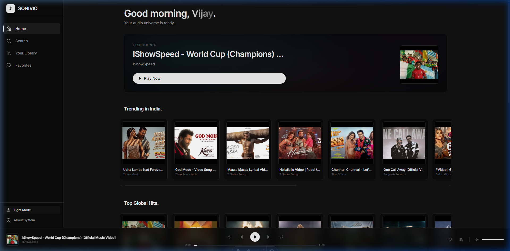
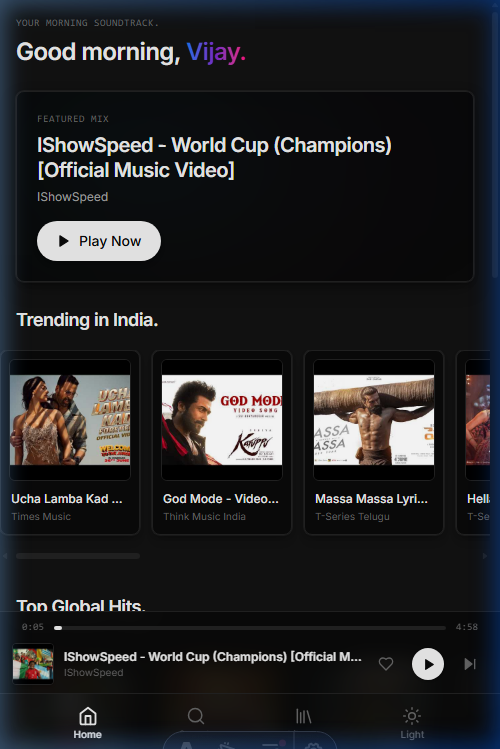
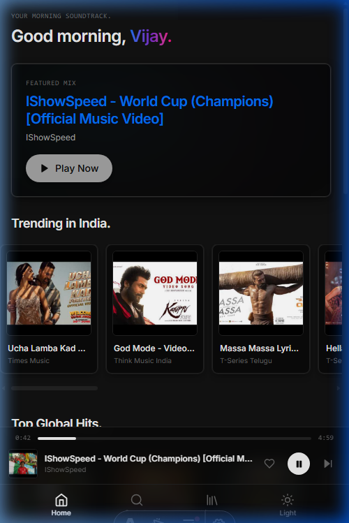

# SONIVIO v2 — Premium Music Streaming Platform

SONIVIO is a fast, lightweight, and visually premium music streaming portfolio application built with a Vercel-inspired stark minimal design. It leverages server-side rendering (SSR), Astro Islands architecture, and a secure serverless API proxy layer to stream music directly via the YouTube Data API v3 without exposing sensitive API credentials to client browsers.

---

## 📸 Screenshots

### Desktop View (Sleek Dark Mode)


### Mobile Layout (Home Greeting & Playing View)
<p align="left">
  
  
</p>

---

## ✨ Features

### Client Features
* **Dynamic Time-Based Greeting**: Greets users dynamically (e.g., *Good morning, Vijay.*) with a premium gradient accent text depending on the local system time.
* **Smart Music Search**: Search for songs, playlists, albums, and channels directly.
* **Persistent Queue Manager**: Play, pause, seek, adjust volume, skip tracks, reorder items, and manage queue state. Queue state persists across browser reloads.
* **Custom Playlists**: Create, rename, delete, and add tracks to custom personal playlists stored locally.
* **Favorites & Listen History**: Save tracks to your favorites list and view your recently played tracks (utilizing virtual list rendering for fast performance).
* **Mood Mixes**: Launch curated search mixes dynamically (e.g., Focus, Energy, Chill).

### Technical Engineering Features
* **Astro Islands (Partial Hydration)**: Server-renders standard static HTML pages while loading individual interactive components (like the player controls) as hydrated React components.
* **Continuous Playback (ClientRouter)**: Employs Astro `<ClientRouter />` (View Transitions) and persistent React islands (`transition:persist`) to keep music playing seamlessly during page navigation.
* **Secure Serverless Edge Routing**: Proxies all YouTube API traffic through `/api/youtube.ts` to secure credentials and avoid exposing Google Cloud API keys in client headers.
* **Decoupled Zustand Architecture**: Divides state management into four separate stores (`playerStore`, `queueStore`, `libraryStore`, `uiStore`) for scalable memory management.
* **Virtual List Scrolling**: Employs `@tanstack/react-virtual` to virtualize large listening histories, keeping scroll speeds locked at 60FPS.

---

## 🧰 Tech Stack

- **Meta-Framework**: [Astro 6.4 (SSR Mode)](https://astro.build/)
- **Core UI Logic**: [React 18](https://react.dev/)
- **Styling**: [Tailwind CSS v4](https://tailwindcss.com/) (CSS-First Theme Config)
- **State Management**: [Zustand](https://github.com/pmndrs/zustand)
- **Animations & Transitions**: [Framer Motion](https://www.framer.com/motion/)
- **API Engine**: YouTube Data API v3 (Secured via local proxy routing)
- **Hosting/Server**: [Cloudflare Pages](https://pages.cloudflare.com/) (Edge Worker runtime compatibility)

---

## 📦 How to Run

### Prerequisites
- Node.js v20 or newer
- A Google Cloud Platform [YouTube Data API v3 API Key](https://console.cloud.google.com/)

### Installation

1. **Clone the repository**:
   ```bash
   git clone https://github.com/vijaybarhate/SONIVIO-Music-Player.git
   cd SONIVIO-Music-Player
   ```

2. **Install dependencies**:
   ```bash
   npm install
   ```

3. **Configure Environment Variables**:
   Create a `.env` file in the root directory:
   ```env
   VITE_YOUTUBE_API_KEY=AIzaSy...your_youtube_api_key_here
   ```

4. **Start the Development Server**:
   ```bash
   npm run dev
   ```
   Open `http://localhost:4321` in your browser.

---

## 🧠 Challenges Faced

- **Persistent Audio Across Routing**: Using a traditional single-page application router with Astro is usually trivial, but retaining an active React audio player element across Astro's page transitions required carefully scoping React components with `client:only="react"` and Astro's `transition:persist` feature, alongside disabling conflicting Framer Motion page entrance transitions.
- **Visual Congestion on Mobile**: Mobile viewports have limited space. Initial implementations crowded the compact bottom player bar with Volume, Like, Previous, Play/Pause, and Next buttons. We resolved this by locking the bottom nav to `bottom-0` and placing a simplified compact player (rendering only Like, Play/Pause, and Next) at `bottom-14`, moving full control sets to the Expanded Player panel.
- **Tailwind CSS v4 Configuration**: Transitioning from v3's JavaScript configuration to v4's CSS-first theme configuration required setting up CSS custom properties inside `@theme` blocks inside `global.css` and using `@custom-variant` configurations to ensure the custom dark mode variant matched correctly.
- **Edge Deployment compatibility**: Standard packages sometimes rely on Node.js-only modules. We structured our secure proxy logic to use standard web APIs (`fetch`, `Headers`) so it compiles and deploys seamlessly on Cloudflare's lightweight `workerd` runtime.

---

## 🔮 Future Improvements

- [ ] **User Sync / Database Integration**: Support accounts and sync playlists across multiple devices using a cloud database (e.g. Supabase or Cloudflare D1).
- [ ] **Lyrics Syncing**: Integrate a lyrics API provider to display synchronized scrolling text during audio playback.
- [ ] **PWA / Offline support**: Implement service workers to cache streamed assets and support basic offline listening.
- [ ] **Playlist Collaboration**: Allow multiple users to join, edit, and contribute to shared play queues.

---

Built with 🖤 by [Vijay Barhate](https://github.com/vijaybarhate)
